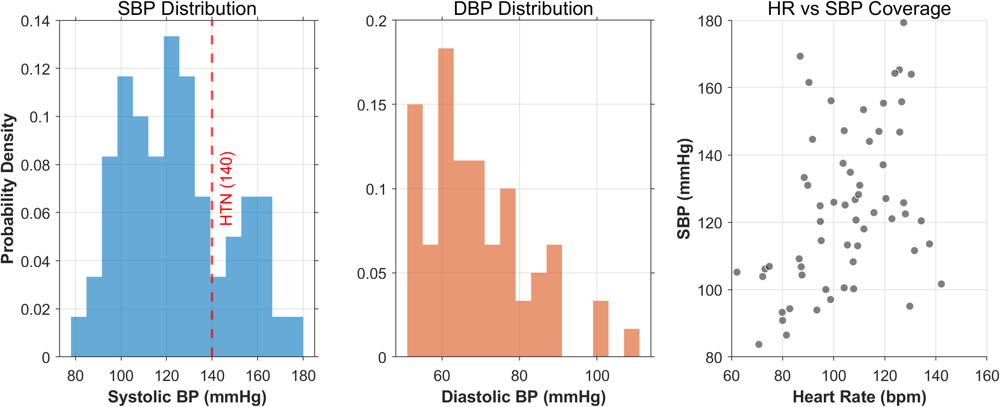

<div align="center">
  <p><b>语言：</b> <a href="README.md">English</a> | <b>简体中文</b></p>
</div>

<div align="center">
  <h1>🫀 Robust-Blood_Pressure-Benchmark</h1>
  <p><b>专为连续血压估计打造的：高度精选、类均衡且包含高波动数据的 MIMIC-II 子集</b></p>

[](https://doi.org/10.5281/zenodo.19912053)
[](LICENSE)
[](https://www.mathworks.com/)

</div>

---

## 📌 项目简介 (Overview)

在开发连续无创血压（cNIBP）估计的机器学习模型时，最大的瓶颈之一是 MIMIC-II 等原始临床数据库中存在极端的类别不平衡。绝大多数数据段代表的是正常血压，导致模型在预测关键的高血压或低血压事件时表现极差。

**Robust-BP-Bench** 通过提供严格的 **4 区间分层采样协议 (4-bin stratified sampling protocol)** 解决了这一痛点。我们从 MIMIC-II 中提取了一个经过高度精选的子集，强制要求所有血压范围内的数据表示均等，从而确保你的模型能够学习到具有鲁棒性的底层特征，而不仅仅是预测一个平均值。

### 核心特性 (Key Features)
- **4 区间分层 (4-Bin Stratification)：** 在低血压 (<110)、正常 (110-130)、偏高 (130-150) 和高血压 (>150 mmHg) 四个类别间实现完美均衡。
- **严格质量控制 (Strict Quality Control)：** 内置算法自动过滤低方差信号、严重伪影和线性度极差的数据段。
- **深度学习就绪 (Ready for Deep Learning)：** 提供高信噪比 (SNR) 的生理信号，可直接用于特征提取或端到端模型训练。

---

## 🚀 零门槛快速上手 (Demo 模式)

想在不下载 50GB 原始 MIMIC-II 数据库的情况下，快速体验本筛选协议是如何工作的？我们提供了一个零依赖的合成数据生成器。

```bash
# 1. 克隆本仓库
git clone [https://github.com/phish-tech/Robust-Blood_Pressure-Benchmark.git](https://github.com/phish-tech/Robust-Blood_Pressure-Benchmark.git)
cd Robust-Blood_Pressure-Benchmark

# 2. 在 MATLAB 中运行合成数据生成器
>> generate_demo_dataset

# 3. 执行核心筛选协议 (请确保代码内 IS_DEMO_MODE = true)
>> run_data_selection
```

*该脚本将瞬间解析 Demo 数据，并输出一个完美均衡的 `demo_sampled_balanced.mat`。*

---

## 💾 下载完整数据集

源自真实 MIMIC-II 数据库、大小为 1GB 的完整“黄金子集”已托管至 Zenodo，供全球研究者永久开放访问。

👉 **通过 Zenodo 下载 [Robust-BP-Bench (dataset_sampled_balanced.mat)](https://zenodo.org/records/19912053)**

---

## 📊 数据集分布 (Demographics)

我们的协议保证了均衡的数据分布，这对于训练无偏回归模型至关重要。

### 全部数据集分布展示


### 部分数据集分布展示
<div align="center">
  
  <p><i>图 1: 精选子集的人口统计学分布，展示了完美均衡的 SBP 类别以及广泛的心率覆盖范围。</i></p>
</div>


---

## 📚 引用 (Citation)

如果您在研究中使用了此数据筛选协议或我们策划的数据集，请引用我们即将发表的 EMBC 2026 论文（预印本）：

**From Elastic to Viscoelastic: An EEMD-Enhanced Pulse Transit Time Model for Robust Blood Pressure Estimation

https://arxiv.org/abs/2604.27500**


---

## 🔬 基于此项数据的研究：EMBC 2026 录用成果

本项目开源的 `Robust-BP-Bench` 数据集，正是为了支撑我们课题组在连续无创血压领域的最新突破。该成果已被 **IEEE EMBC 2026** 正式录用。

> 📄 **论文题目:** *From Elastic to Viscoelastic: An EEMD-Corrected PTT Model for Precise Blood Pressure Tracking*

### 💡 为什么传统 PTT 模型会失效？
现有的脉搏波传导时间 (PTT) 模型普遍基于 Moens-Korteweg 方程，它们假设完全基于人体血管是“纯弹性”的刚性管道。然而，真实的生物组织具有**粘弹性 (Viscoelasticity)**。在血压剧烈波动时，这种粘弹性会导致 PTT 与实际血压之间产生严重的“迟滞 (Hysteresis)”效应，从而导致传统模型的精度断崖式下跌。

### 🚀 我们的破局之道 (The Secret Sauce)
我们提出了一种全新的 EEMD 修正 PTT 物理混合模型，完成了从“纯弹性”到“粘弹性”的范式跃迁：

1. **切线相交法波足定位 (Intersecting Tangent Method):** 摒弃了极不稳定的极值点检测，利用 10 倍 Makima 高保真插值与最大上升斜率切线，为 PTT 计算提供了符合严谨血流动力学定义的稳定基准。
2. **EEMD 粘弹性补偿 (Viscoelastic Compensation):** 利用集合经验模态分解 (EEMD)，我们将 PPG 信号“拆解”，提取出高频模态的微分能量作为“粘弹性补偿特征”，完美量化了信号的动力学强度，大幅抵消了运动伪影与迟滞误差。

   

### 🏆 实验表现
在基于本仓库开源的包含 23.4% 高血压样本的极端临床数据集上，我们的算法展现出了优秀的表现：


* **极强的 Beat-to-Beat 追踪:** 无论血压是处于剧烈波动、急剧上升还是下降趋势，EEMD 修正模型都能紧紧贴合动脉真实血压 (Ground Truth)。


🔔 **完整核心代码预告:** 包含 EEMD 信号拆解与切线波足定位的算法框架，将在论文正式见刊后于本项目中开源。
**[⭐ Star 本仓库]** 以获取第一时间的更新通知！

🌐 了解更多关于 EMBC 2026 会议的信息，请访问：[EMBC Official Website](https://embc.embs.org/)
